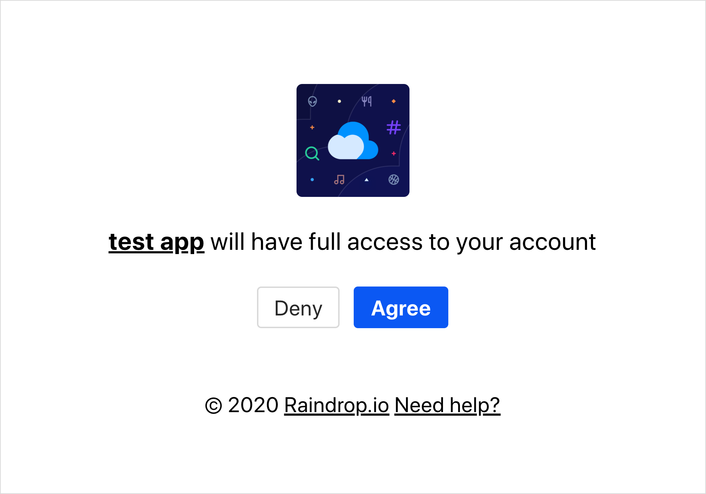

# Obtain access token

External applications could obtain a user authorized API token via the OAuth2 protocol. Before getting started, developers need to create their applications in [App Management Console](https://app.raindrop.io/#/settings/apps/dev) and configure a valid OAuth redirect URL. A registered Raindrop.io application is assigned a unique `Client ID` and `Client Secret` which are needed for the OAuth2 flow.

This procedure is comprised of several steps, which will be described below.


If you just want to test your application, or do not plan to access any data except yours account you don't need to make all of those steps.

Just go to [App Management Console](https://app.raindrop.io/#/settings/apps/dev) and open your application settings. Copy **Test token** and use it as described in **Step 4.**




Step 1: The authorization request



Direct the user to our authorization URL with specified request parameters.  
— If the user is not logged in, they will be asked to log in  
— The user will be asked if he would like to grant your application access to his Raindrop.io data






Redirect URL configured in your application setting



The unique Client ID of the Raindrop.io app that you registered







Check details in Step 2


```

```







### Step 2: The redirection to your application site

When the user grants your authorization request, the user will be redirected to the redirect URL configured in your application setting. The redirect request will come with query parameter attached: `code` .

The `code` parameter contains the authorization code that you will use to exchange for an access token.

In case of error redirect request will come with `error` query parameter:

| Error | Description |
| :--- | :--- |
| access\_denied | When the user denies your authorization request |
| invalid\_application\_status | When your application exceeds the maximum token limit or when your application is being suspended due to abuse |



Step 3: The token exchange



Once you have the authorization `code`, you can exchange it for the `access_token` by doing a `POST` request to this URL






Code that you received in step 2



The unique Client ID of the Raindrop.io app that you registered



Client secret



Same `redirect_uri` from step 1



**authorization\_code**










```
{
  "access_token": "ae261404-11r4-47c0-bce3-e18a423da828",
  "refresh_token": "c8080368-fad2-4a3f-b2c9-71d3z85011vb",
  "expires": 1209599768,
  "token_type": "Bearer"
}
```




Occurs when `code` parameter is invalid


```
{"error": "bad_authorization_code"}
```







♻️ The access token refresh



For security reasons access tokens \(except "test tokens"\) will **expire after two weeks**. In this case you should request the new one, by calling `POST` request with such parameters:






The unique Client ID of your app that you registered



Client secret of your app



**refresh\_token**



Refresh token that you get in step 3










```
{
  "access_token": "ae261404-18r4-47c0-bce3-e18a423da898",
  "refresh_token": "c8080368-fad2-4a9f-b2c9-73d3z850111b",
  "expires": 1209599768,
  "token_type": "Bearer"
}
```





